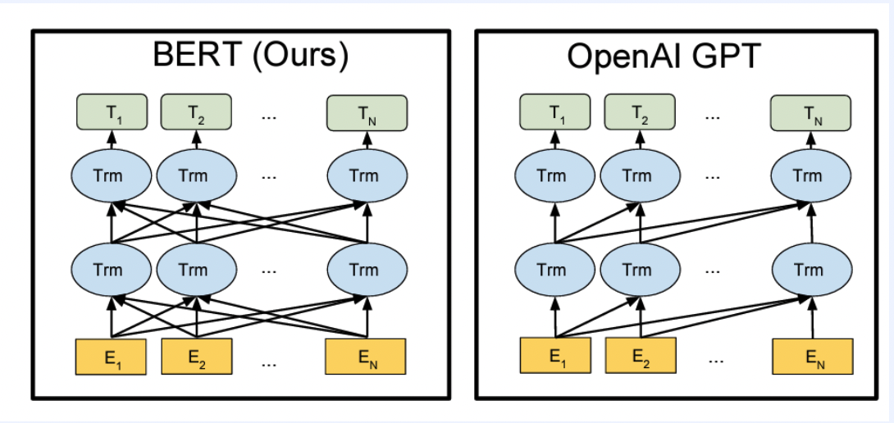
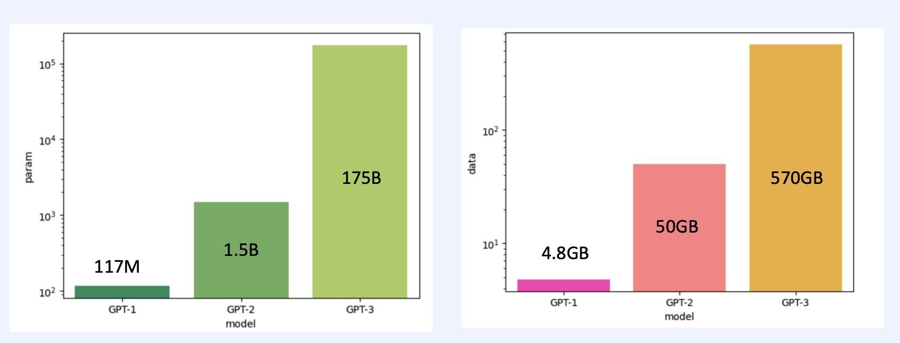

## GPT (Generative Pre-Training)
* 사전 학습을 통한 생성 모델

* Supervised Learning 은 Label 된 데이트 셋을 준비하는건 많은 시간이 필요
* UnSupervised Learning 은 섬세한 문제를 푸는것은 한정적임 
    * => Unsupervised Pre-train 을 사용

* 많은 Unlabeled Data 로 모델에 먼저 학습 (pre-train)
* 그 후 학습된 모델을 내가 풀어내고 싶은 문제로 학습 (fine-tuning)
* 사전 지식 많은 사람(모델)이 더 잘 풀것
* pretrain + fintuning
* pre-train 방식
    * NSP(Next Sentence Prediction) 다음문장 판별
    * MLM(Masked Language Model) 빈칸 채우기
    * NWP(Next Word Preiction) 다음에 올 단어 예측
* fine-tuing 방식
    * data set
        * Natural language inference (두가지 명제에 관계)
        * Question aNswering
        * Sentence similarity
        * Classification

## GPT vs BERT

* BERT 는 모든 토큰들이 Transformer Layer 로 들어감 => 모든 언어를 보고 이해를 위한 모델
    * TM 의 Encoder 부분만 사용
* GPT 는 현재 시점 보다 과거의 토큰만 input 으로 들어감 => 이전 언어를 보고 다음 언어를 생성하기 위한 모델(UniDirectional)
    * TM 의 Decoder 부분만 사용
    * 이전 시점의 출력을 다음 시점의 입력으로 사용
        * => Autoregressice decoder 

## Bart
* Bidirectional Encoder & Autoregressive Decoder
* Encoder & Decoder 를 가지고 있음
* corrupt 된 텍스트를 인풋으로 받은 뒤 원본 텍스트를 예측
* Pre-training
    * Denoising(텍스트에 노이즈를 삽입해 입력하고, 원본 텍스트를 복원)
    * MLM (임의의 토큰을 특정 확률로 <MASK> 토큰으로 대체)
    * Token Deletion (임의의 토큰을 특정 확률로 삭제, 어디가 빈칸인지도 맞추기)
    * Text Infilling (<MASK> 에 토큰이 안들어갈 수도 있는데 이것도 맞추기)
    * Sentence Permutation (. 온점 으로 두문장 순서 바꿈 => 원래 순서 맞추기)
    * Document Rotation (토큰 하나를 선택해서 문장의 맨 앞으로 이동한뒤 원래 순서로 정렬)
* BART 는 원본이 무엇이였는지 예측 (Denoising auto encoder)
* 마지막 output 에 linear classifier 를 추가하여 분류

## GPT vs BERT vs BART

* BERT 는 각각의 Masking 된 B, D 를 output 으로 내보내고, A, C, E 는 내보내지않음
* GPT 는 다음 토큰 예측 
* BART 는 noise 있는 데이터를 받고, 전체 문장 복원

## GPT-2
* 더 많은 데이터 (웹 데이터)
* zero-shot setting 으로 검증
    * fine tuning 을 통해 파라미터나 구조에 대한 변형 없이 바로 down-stram task(구체적으로 풀고 싶은 문제) 에 적용

## T5 (Text-to-Text Transfer Transformer)
* Text-to-Text: 텍스트를 인풋 아웃풋으로
* Transfer: 모델이 먼저 대규모 데이터에서 학습 후 downstream task 에서 수행
* Transformer: TM 모델 기반(Encoder/Decoder)
* 모든 데이터에 모델을 공용으로 사용 가능(모든 NLP task 를 통합할수 있게 Text-to-text 프레임 워크 사용)

## Prefix LM
* 어느정도까지는 Bidirection 후 타임 스탭이 하나씩 지날때 마다 하나씩 보여줌

## GPT-3
* GTP 2 에 비해 parameter 수가 크게 늠
    * GPT-2 XL param: 1.5B
    * GPT3 큰 모델 param: 175B
* sparse-attention 사용(효율을 위해)
    * 모든 토큰을 참조하는 대신 일부만 참조 (성능에 부하가 덜가게 함)
    * fixed 는 정보가 모이는 점인데 이를 모은 뒤 다음꺼만 참조

* in-context learning
    * pretrain 기간안에 같은 패턴을 가진 sequence 를 다양하게 입력하여 문제해결력을 기름
        * 하나의 모델이 다양한 방식을 학습
        
* zero-shot(아무런 예시없는경우), one-shot(하나의 예시), few-shot (여러 예시)
* fine-tuning 에서는 추가적인 가중치 업데이트가 발생
* few-shot 은 가중치 업데이트가 발생하지 않음

## Seq2Seq
* 순차적인 데이터를 입력 받은 뒤 순차적인 데이터를 출력
* encoder 로 context vector 생성
* decoder 로 context vector 를 받아 순차적으로 출력을 생성
* encoder 와 decoder 는 LSTM 으로 이뤄져 있음

 ## Bandanau attention
 * 각 시점마다 어텐션을 다르게 줌 
 
 ## Transformer: Self-Attention
 * 어떤 단어가 어떤 단어와 관련있는지에 따라 가중치를 생성

 ## Bert
 * TM encoder 를 여러개 쌓아 수행

## GPT series scale

